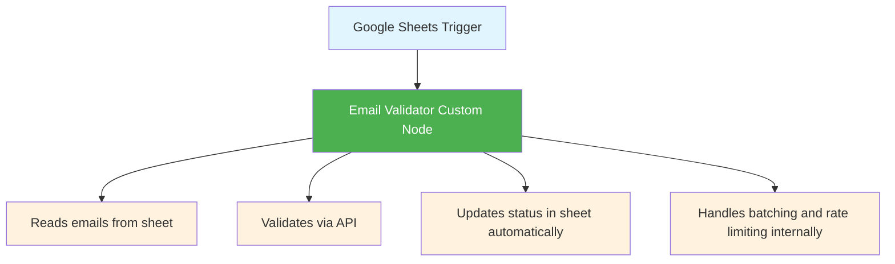
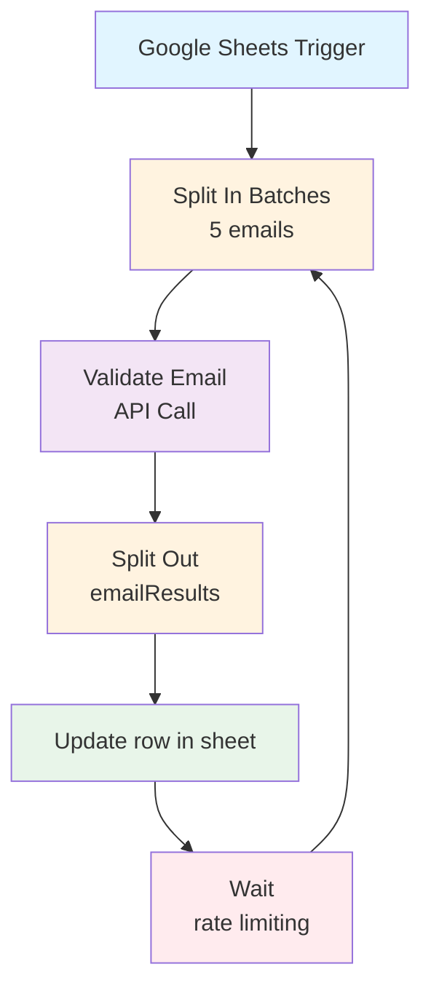
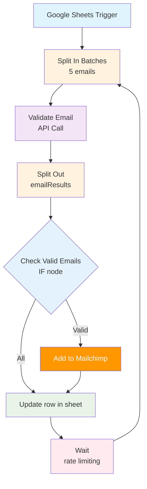

# Email Validator Workflows

This folder contains ready-to-use n8n workflows for email validation using the MailValidator AI Agent API. These workflows automate the process of validating email addresses from Google Sheets and optionally syncing valid emails to Mailchimp.

> **⚠️ Important:** These workflows contain placeholder values (e.g., `YOUR_GOOGLE_SHEET_ID`, `YOUR_MAILCHIMP_LIST_ID`) that you must replace with your own values after importing. Credential references in the workflows are instance-specific and will need to be configured in your n8n instance.

## 📁 Project Structure

```
mail-validator-workflow-nodes/
└── n8n-workflows/                # Ready-to-use n8n workflows
    ├── Octalchip Email Validator.json
    ├── Email Validator AI Agent.json
    ├── Email Validator AI Agent with Mailchimp.json
    └── README.md
```

> **Note:** The custom Email Validator node (`n8n-nodes-mailvalidator`) is a separate package. Install it with `npm install n8n-nodes-mailvalidator` or see the [package repository](https://github.com/octalchip/mail-validator-workflow-nodes) for source code.

## 📋 Available Workflows

### 1. Octalchip Email Validator (Recommended)
A streamlined workflow using the custom Email Validator node for simplified setup and automatic sheet updates.

**File:** `Octalchip Email Validator.json`

**Features:**
- Uses the custom Email Validator n8n node (requires installation)
- Monitors Google Sheets for new email entries
- Automatically validates emails and updates the status column in real-time
- Handles batch processing and rate limiting internally
- Simplified workflow with just 2 nodes (Trigger + Validator)
- No manual batching or status update nodes required

**Note:** This workflow requires the custom Email Validator node to be installed. See the [Custom Node Installation](#custom-node-installation) section below.

### 2. Email Validator AI Agent
A basic workflow that validates emails from Google Sheets and updates the validation status back to the sheet using HTTP requests.

**File:** `Email Validator AI Agent.json`

**Features:**
- Monitors Google Sheets for new email entries
- Validates emails in batches using the MailValidator API via HTTP requests
- Updates the status column in Google Sheets with validation results
- Processes emails in batches of 5 to optimize API usage
- Uses standard n8n nodes (no custom node installation required)

### 3. Email Validator AI Agent with Mailchimp
An enhanced workflow that includes all features of the basic workflow plus automatic Mailchimp integration.

**File:** `Email Validator AI Agent with Mailchimp.json`

**Additional Features:**
- Automatically adds valid emails to your Mailchimp audience
- Filters emails to only add those with "valid" status
- Maintains the same Google Sheets integration as the basic workflow
- Uses standard n8n nodes (no custom node installation required)

## 🚀 Quick Start

### Prerequisites

Before importing these workflows, ensure you have:

1. **n8n Instance** - A running n8n instance (cloud or self-hosted)
2. **MailValidator API Account**
   - Sign up at: https://mailvalidator.octalchip.com/
   - Generate your API key from the [API Documentation](https://mailvalidator.octalchip.com/docs)
3. **Google Sheets Account** - For reading and updating email data
4. **Mailchimp Account** (Optional) - Only required for the Mailchimp workflow
   - A Mailchimp account with an audience/list ID
5. **Custom Node Installation** (Required for "Octalchip Email Validator" workflow only)
   - Install the custom node package: `npm install n8n-nodes-mailvalidator`
   - For detailed installation instructions, see the [n8n-nodes-mailvalidator package documentation](https://www.npmjs.com/package/n8n-nodes-mailvalidator)

### Google Sheets Setup

Create a Google Sheet with the following structure:

| email               | status |
|---------------------|--------|
| test@mail.com       |        |
| demo@example.com    |        |

**Required Columns:**
- `email` - The email address to validate
- `status` - Will be automatically updated with validation results (valid, invalid, etc.)

## 📥 Importing Workflows

### Method 1: Import via n8n UI

1. Open your n8n instance
2. Click on **"Workflows"** in the sidebar
3. Click **"Import from File"** or use the **"+"** button and select **"Import from File"**
4. Select the workflow JSON file you want to import:
   - `Octalchip Email Validator.json` - Streamlined workflow using custom node (requires custom node installation)
   - `Email Validator AI Agent.json` - Basic workflow using HTTP requests
   - `Email Validator AI Agent with Mailchimp.json` - Workflow with Mailchimp integration
5. The workflow will be imported and you can configure the credentials

### Method 2: Import via n8n CLI

```bash
n8n import:workflow --input=workflows/Octalchip\ Email\ Validator.json
# OR
n8n import:workflow --input=workflows/Email\ Validator\ AI\ Agent.json
# OR
n8n import:workflow --input=workflows/Email\ Validator\ AI\ Agent\ with\ Mailchimp.json
```

## 📦 Custom Node Installation

**Required only for the "Octalchip Email Validator" workflow.**

The custom Email Validator node provides a streamlined experience with automatic sheet updates and built-in batch processing. To use this workflow, you must first install the custom node.

### Installation

Install the custom node package:

```bash
npm install n8n-nodes-mailvalidator
```

After installation, restart n8n and the custom node will be available.

For detailed installation instructions, troubleshooting, and development setup, see the [n8n-nodes-mailvalidator package documentation](https://www.npmjs.com/package/n8n-nodes-mailvalidator).

## ⚙️ Configuration

After importing, you need to configure the following credentials. The configuration steps vary depending on which workflow you're using.

### Configuration for "Octalchip Email Validator" Workflow

This workflow uses the custom Email Validator node, which requires two credentials in a specific order:

#### 1. Email Validator API Credential (First)

1. Click on the **"Email Validator"** node
2. Click on the first credential field: **"Credential to connect with (Email Validator account)"**
3. Click **"Create New Credential"** or select existing
4. Choose **"Email Validator API"** from the credential type dropdown
5. Configure the credential:
   - **Authentication Type:** Select **API Key**
   - **API Key:** Enter your API key (format: `evapi_...`)
6. Click **"Save"**

#### 2. Google Sheets OAuth2 Credential (Second)

1. In the same **"Email Validator"** node
2. Click on the second credential field: **"Credential to connect with (Google Sheets account)"**
3. Click **"Create New Credential"** or select existing
4. Choose **"Google Sheets OAuth2 API"**
5. Follow the OAuth2 flow to connect your Google account
6. Grant necessary permissions for reading and writing to Google Sheets
7. Click **"Save"**

#### 3. Update Sheet Configuration

1. In the **"Email Validator"** node, update the **"Sheet ID"** parameter
2. Enter your Google Sheet URL or Sheet ID
3. The node will automatically read emails and update the status column

### Configuration for "Email Validator AI Agent" Workflows

These workflows use standard n8n nodes and require the following configuration:

#### 1. MailValidator API Credentials

1. In the **"Validate Email"** node, click on the credentials dropdown
2. Select **"Create New Credential"** or use existing
3. Choose **"Header Auth"** as the authentication type
4. Enter your MailValidator API key:
   - **Name:** `API-Key` (or as required by the API)
   - **Value:** Your API key from mailvalidator.octalchip.com

#### 2. Google Sheets Credentials

You'll need to configure credentials for two Google Sheets nodes:

#### Google Sheets Trigger
1. Click on the **"Google Sheets Trigger"** node
2. Configure OAuth2 credentials:
   - Click **"Create New Credential"**
   - Follow the OAuth2 flow to connect your Google account
   - Grant necessary permissions for reading Google Sheets

#### Update Row in Sheet
1. Click on the **"Update row in sheet"** node
2. Configure OAuth2 credentials (can reuse the same as trigger)
   - Ensure write permissions are granted

### 3. Mailchimp Credentials (Mailchimp Workflow Only)

1. Click on the **"Add to Mailchimp"** node
2. Configure Mailchimp API credentials:
   - Click **"Create New Credential"**
   - Enter your Mailchimp API key
   - Select your audience/list ID

### 4. Update Workflow Settings

After configuring credentials, update these settings:

#### Google Sheets Configuration
- **Document ID:** Update with your Google Sheet ID (found in the sheet URL)
- **Sheet Name:** Update with your sheet name (default: "Sheet1")
- **Matching Column:** Ensure "email" is set as the matching column

#### Mailchimp Configuration (Mailchimp Workflow Only)
- **List ID:** Update with your Mailchimp audience/list ID
- **Status:** Set to "subscribed" (or your preferred status)

#### Batch Processing
- **Batch Size:** Currently set to 5 emails per batch (adjustable in "Split In Batches" node)
- **Wait Time:** Configured to prevent rate limiting (adjustable in "Wait" node)

## 🔄 Workflow Flow

### Octalchip Email Validator Flow (Custom Node)



**Note:** This workflow is the simplest - the custom node handles all validation and sheet updates automatically.

### Basic Workflow Flow (HTTP Request)



### Mailchimp Workflow Flow (HTTP Request)



## 📊 Understanding Validation Results

The workflow updates the `status` column in your Google Sheet with validation results. Common status values include:

- `valid` - Email address is valid and deliverable
- `invalid` - Email address is invalid or undeliverable
- `unknown` - Unable to determine validity

## 🎯 Use Cases

### Octalchip Email Validator (Custom Node)
- **Simplest setup** - Just 2 nodes, automatic sheet updates
- Email list cleaning and validation
- Real-time validation as emails are added
- Lead qualification with automatic status tracking
- Database maintenance

### Basic Workflow (HTTP Request)
- Email list cleaning and validation
- Lead qualification
- Database maintenance
- Pre-send email validation
- **No custom node installation required**

### Mailchimp Workflow (HTTP Request)
- Automated email list building
- Validated subscriber onboarding
- Lead nurturing automation
- Marketing campaign preparation
- **No custom node installation required**

## 🔧 Customization

### Adjusting Batch Size

To change the number of emails processed per batch:

1. Open the **"Split In Batches"** node
2. Modify the **"Batch Size"** parameter (default: 5)
3. Consider API rate limits when adjusting

### Changing Validation Type

The workflow uses `"validationType": "bulk"` by default. To modify:

1. Open the **"Validate Email"** node
2. Edit the JSON body expression
3. Change `validationType` to your preferred option

### Modifying Wait Time

To adjust rate limiting:

1. Open the **"Wait"** node
2. Configure the wait duration
3. Consider your API rate limits

## 🐛 Troubleshooting

### Common Issues

**Issue:** Workflow not triggering
- **Solution:** Ensure the Google Sheets Trigger is activated and the workflow is active

**Issue:** API authentication errors
- **Solution:** 
  - For custom node workflow: Verify your Email Validator API credential is correctly configured
  - For HTTP request workflows: Verify your MailValidator API key is correctly configured in the HTTP Request node

**Issue:** Custom node not appearing in n8n
- **Solution:** Ensure the custom node package (`n8n-nodes-mailvalidator`) is installed and n8n has been restarted after installation. See the [package documentation](https://www.npmjs.com/package/n8n-nodes-mailvalidator) for troubleshooting.

**Issue:** Google Sheets not updating
- **Solution:** Check OAuth2 permissions and ensure write access is granted

**Issue:** Mailchimp not adding contacts
- **Solution:** Verify list ID and API credentials are correct

### Debugging Tips

1. **Test Individual Nodes:** Use n8n's "Execute Node" feature to test each node independently
2. **Check Execution Logs:** Review execution history for detailed error messages
3. **Validate Data Format:** Ensure email column format matches expected structure
4. **API Rate Limits:** Monitor API usage to avoid hitting rate limits

## 📝 Notes

### Workflow Comparison

| Feature | Octalchip Email Validator | Email Validator AI Agent | Email Validator AI Agent + Mailchimp |
|---------|---------------------------|-------------------------|--------------------------------------|
| Custom Node Required | ✅ Yes | ❌ No | ❌ No |
| Setup Complexity | ⭐ Simple | ⭐⭐ Moderate | ⭐⭐⭐ Advanced |
| Number of Nodes | 2 nodes | 6 nodes | 7 nodes |
| Automatic Sheet Updates | ✅ Yes | ✅ Yes | ✅ Yes |
| Batch Processing | ✅ Built-in | ✅ Manual | ✅ Manual |
| Mailchimp Integration | ❌ No | ❌ No | ✅ Yes |
| Rate Limiting | ✅ Built-in | ✅ Manual | ✅ Manual |

### General Notes

- The workflows process emails in batches to optimize API usage and prevent rate limiting
- The "Octalchip Email Validator" workflow handles batching and rate limiting automatically via the custom node
- The HTTP request-based workflows use "Wait" nodes to prevent overwhelming the API
- The "Email Validator AI Agent" workflows include a sticky note with setup instructions visible in the n8n editor
- All workflows are set to poll Google Sheets every minute by default
- The custom node workflow is recommended for users who want the simplest setup experience

## 🔗 Resources

- [MailValidator API Documentation](https://mailvalidator.octalchip.com/docs)
- [n8n Documentation](https://docs.n8n.io/)
- [Google Sheets API](https://developers.google.com/sheets/api)
- [Mailchimp API Documentation](https://mailchimp.com/developer/)

## 📄 License

These workflows are provided as-is for use with n8n. Please ensure you comply with all API terms of service and rate limits.

## 🤝 Support

For issues related to:
- **Workflow functionality:** Check n8n community forums
- **API issues:** Contact MailValidator support
- **Integration questions:** Refer to respective API documentation

---

**Last Updated:** 2025

